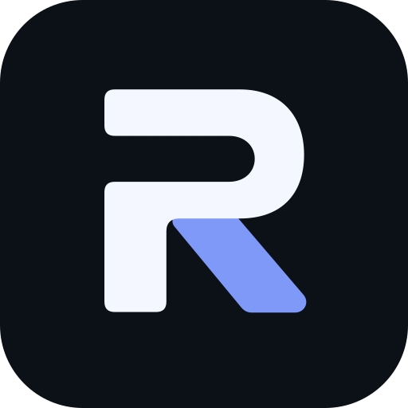

<p align="center">
  
</p>

<h1 align="center">Roqer</h1>

<p align="center">
  <b>An open-source AI agent for Roblox Studio.</b><br>
  Tell it what you want, and it builds, scripts, and playtests it in your place,<br>
  using the ChatGPT or Claude subscription you already have.
</p>

<p align="center">
  <a href="https://github.com/S4US/Roqer/actions/workflows/ci.yml"></a>
  <a href="LICENSE"></a>
</p>

## Features

- **Your own model.** ChatGPT through the Codex app, Claude through Claude Code, or any OpenAI- or Anthropic-compatible endpoint, including local models.
- **Works in your place.** Reads and edits instances, properties, and scripts. A script edit is refused if the script changed after the agent read it, so it won't overwrite your own changes.
- **Models in Blender.** Turn on the optional Blender integration and the agent models what parts can't make (curved shapes, detailed props, vehicle bodies), checks each model with a preview render, and uploads it into your place. It can render UI icons too.
- **Tests its own work.** Runs solo and multi-client playtests, reads server and client output, takes screenshots, and profiles performance.
- **You stay in control.** Choose how much it may do on its own, from Read only to Full auto, and see every script change as a diff.
- **Built for Roblox.** Bundled Roblox skills, Creator Store search and insertion, and Open Cloud uploads with your own key.
- **Local.** No Roqer account or server. Chats are saved on your computer, and the conversation goes straight to your model provider.

## Getting started

You need:

- Windows and Roblox Studio (macOS is untested)
- [Node.js](https://nodejs.org) 20 or newer
- a model: ChatGPT with the Codex app, Claude with [Claude Code](https://claude.com/claude-code), or any OpenAI- or Anthropic-compatible endpoint

```bash
git clone https://github.com/S4US/Roqer.git
cd Roqer
npm install
npm run build:all
npm run start:desktop
```

Roqer installs its Studio plugin when it starts. Open (or restart) Roblox Studio so it loads the plugin, then open a place, pick a model in Roqer, and ask for something.

## Use the Studio tools from another AI client

Roqer's Studio tools are a standalone [MCP](https://modelcontextprotocol.io) server, so you can also use them from Claude Code, Codex, Cursor, or any other MCP client, without Roqer. After building:

```powershell
claude mcp add robloxstudio -- node C:\path\to\Roqer\packages\robloxstudio-mcp\dist\index.js --auto-install-plugin --plugin-path C:\path\to\Roqer\studio-plugin\MCPPlugin.rbxmx
```

[Connecting a client](studio-plugin/INSTALLATION.md) covers other clients, and [the MCP server guide](docs/mcp-server.md) lists what the tools can do, including a read-only inspector edition.

## Documentation

- [Building from source](docs/building-from-source.md)
- [Configuration](docs/configuration.md)
- [3D modeling with Blender](docs/blender.md)
- [The Studio MCP server](docs/mcp-server.md)
- [Creator Store assets](docs/creator-store-assets.md)
- [Removed tools and parameters](docs/deprecated-api.md)

## Contributing

Contributions are welcome. [CONTRIBUTING.md](CONTRIBUTING.md) explains how to set up, test, and send a change. Please report security problems privately, as [SECURITY.md](SECURITY.md) describes.

## License

[MIT](LICENSE). The MCP server began as a fork of [chrrxs/robloxstudio-mcp](https://github.com/chrrxs/robloxstudio-mcp); [THIRD_PARTY_NOTICES.md](THIRD_PARTY_NOTICES.md) lists the projects Roqer builds on.

Roqer is not affiliated with or endorsed by Roblox Corporation.
