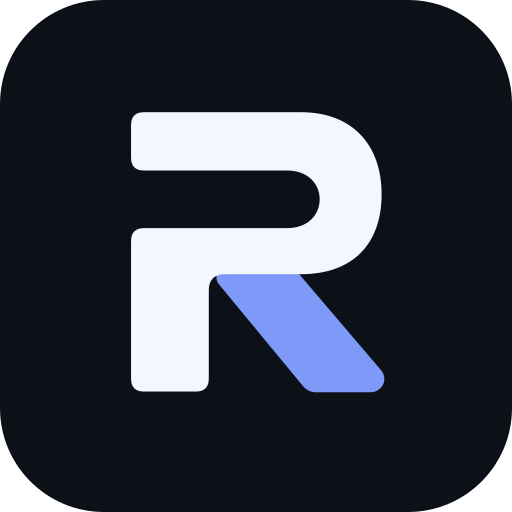
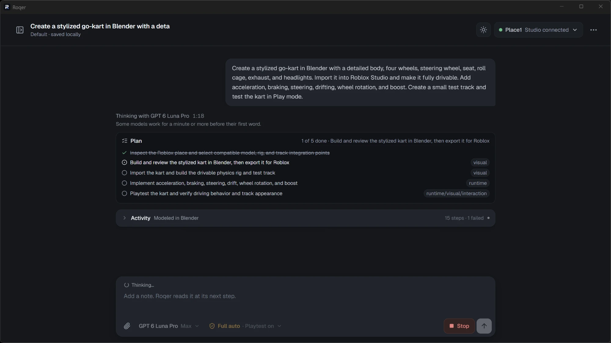
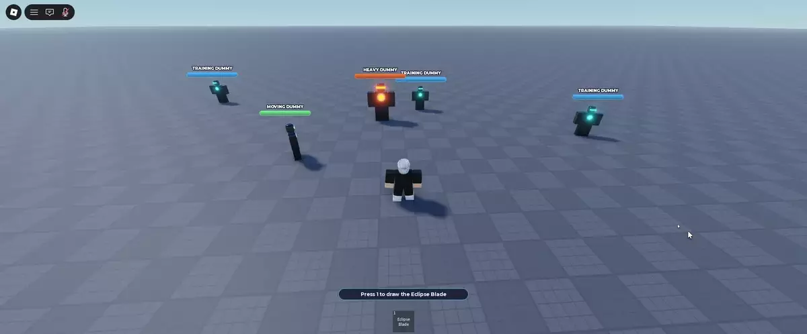
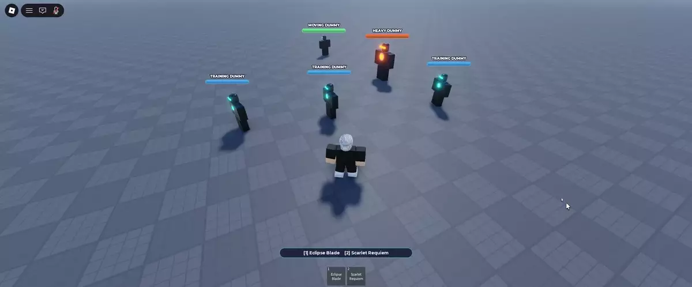

<p align="center">
  
</p>

<h1 align="center">Roqer</h1>

<p align="center">
  <b>An open-source AI agent for Roblox Studio.</b><br>
  Tell it what you want, and it builds, scripts, and playtests it in your place,<br>
  using the ChatGPT or Claude subscription you already have.
</p>

<p align="center">
  <a href="https://github.com/S4US/Roqer/actions/workflows/ci.yml"></a>
  <a href="https://github.com/S4US/Roqer/releases"></a>
  <a href="LICENSE"></a>
</p>

<p align="center">
  
</p>

## Made with Roqer

a sword combat system with a combo, a dash, and two special attacks, in a Studio playtest against training dummies.

<p align="center">
  
</p>

a second weapon, the Scarlet Requiem, with its own combo, a flash step, and three special attacks, ending in a red domain that slashes every dummy inside it.

<p align="center">
  
</p>

## Features

- **Your own model.** ChatGPT through the Codex app, Claude through Claude Code, or any OpenAI- or Anthropic-compatible endpoint, including local models.
- **Works in your place.** Reads and edits instances, properties, and scripts. A script edit is refused if the script changed after the agent read it, so it won't overwrite your own changes.
- **Models in Blender.** Turn on the optional Blender integration and the agent models what parts can't make (curved shapes, detailed props, vehicle bodies), checks each model with a preview render, and uploads it into your place. It can render UI icons too.
- **Character animations.** Ask for a run, a wave or a dance and the agent makes an R15 animation. Roqer checks the motion before Studio sees it, and you can play it in 3D in the chat. The agent then publishes the animation as the place's owner, sets it on your players' characters, and checks in a playtest that it plays.
- **Tests its own work.** Runs solo and multi-client playtests, reads server and client output, takes screenshots, and profiles performance.
- **You stay in control.** Choose how much it may do on its own, from Read only to Full auto, and see every script change as a diff.
- **Built for Roblox.** Bundled Roblox skills, Creator Store search and insertion, and Open Cloud uploads with your own key.
- **Local.** No Roqer account or server. Chats are saved on your computer, and the conversation goes straight to your model provider.

## Getting started

You need:

- Windows and Roblox Studio (macOS is untested)
- [Node.js](https://nodejs.org) 20 or newer
- a model: ChatGPT with the Codex app, Claude with [Claude Code](https://claude.com/claude-code), or any OpenAI- or Anthropic-compatible endpoint

```bash
git clone https://github.com/S4US/Roqer.git
cd Roqer
npm install
npm run build:all
npm run start:desktop
```

Roqer installs its Studio plugin when it starts. Open (or restart) Roblox Studio so it loads the plugin, then open a place, pick a model in Roqer, and ask for something.

If you use ChatGPT or Claude and don't have Codex or Claude Code yet, open Settings in Roqer and choose Install next to your account. Roqer runs OpenAI's or Anthropic's official installer after you confirm, then you connect your subscription.

## Use the Studio tools from another AI client

Roqer's Studio tools are a standalone [MCP](https://modelcontextprotocol.io) server, so you can also use them from Claude Code, Codex, Cursor, or any other MCP client, without Roqer. After building:

```powershell
claude mcp add robloxstudio -- node C:\path\to\Roqer\packages\robloxstudio-mcp\dist\index.js --auto-install-plugin --plugin-path C:\path\to\Roqer\studio-plugin\MCPPlugin.rbxmx
```

[Connecting a client](studio-plugin/INSTALLATION.md) covers other clients, and [the MCP server guide](docs/mcp-server.md) lists what the tools can do, including a read-only inspector edition.

## Documentation

- [Building from source](docs/building-from-source.md)
- [Configuration](docs/configuration.md)
- [3D modeling with Blender](docs/blender.md)
- [Character animation](docs/animation.md)
- [The Studio MCP server](docs/mcp-server.md)
- [Creator Store assets](docs/creator-store-assets.md)
- [Removed tools and parameters](docs/deprecated-api.md)

## Roadmap

What Roqer is working toward. Plans can change; [open an issue](https://github.com/S4US/Roqer/issues) to suggest something.

- Rojo and version control. Work on places whose code lives in a Rojo project: edit the files on disk that Rojo syncs into Studio, instead of only the copy inside Studio, so every change can be reviewed and kept in Git like the rest of your project.
- MacOS support

## Contributing

Contributions are welcome. [CONTRIBUTING.md](CONTRIBUTING.md) explains how to set up, test, and send a change. Please report security problems privately, as [SECURITY.md](SECURITY.md) describes.

## License

Roqer is free software under the [GNU Affero General Public License, version 3 or any later version](LICENSE). [NOTICE.md](NOTICE.md) has the copyright notice and an additional permission for Roblox's LibMP, which the Studio plugin build includes. Roqer 0.1.6 and earlier releases were published under the MIT License.

The MCP server began as a fork of [chrrxs/robloxstudio-mcp](https://github.com/chrrxs/robloxstudio-mcp); [THIRD_PARTY_NOTICES.md](THIRD_PARTY_NOTICES.md) lists the projects Roqer builds on.

Roqer is not affiliated with or endorsed by Roblox Corporation.
